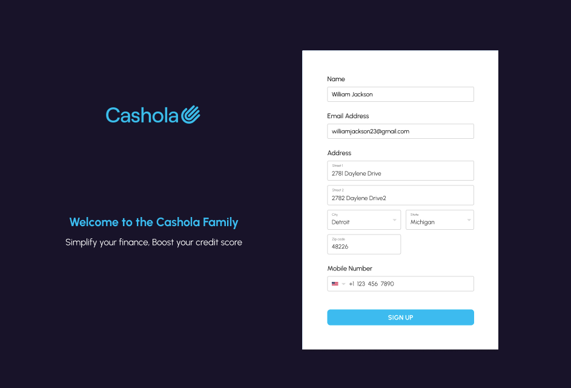
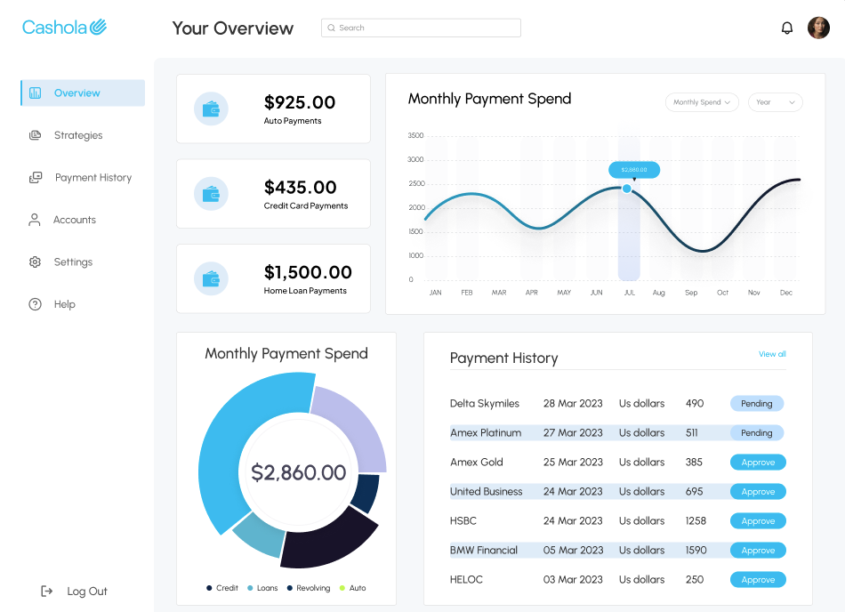
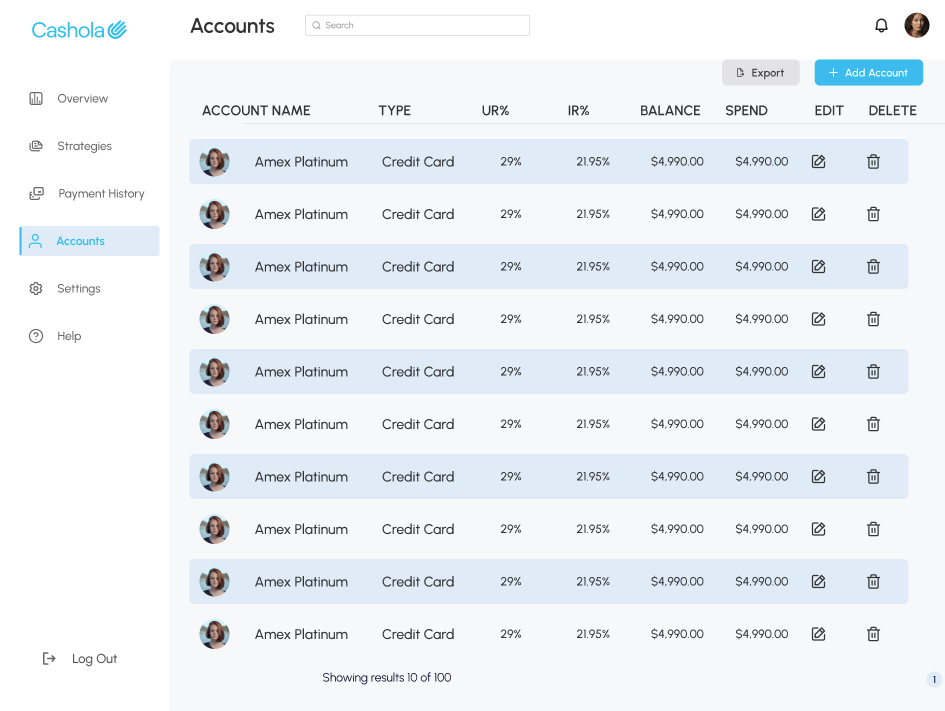
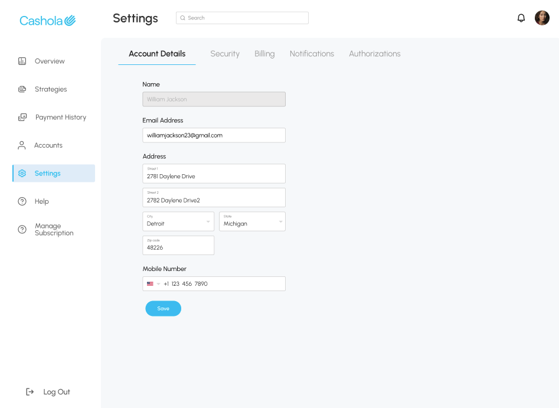

# Cashola - Simplifying Bill Payments

Cashola is a web application that streamlines the process of managing
and paying bills for business professionals. It provides a convenient
platform for users to add their credit cards, view transaction
history, and make bill payments effortlessly.

- [Find me on fiver ](https://www.fiverr.com/zainbinramzan/develop-web-applications-with-mern-stack-react-node-express-moongodbplugin-react/README.md)
- [Find me on linkedin](https://www.linkedin.com/in/abu-zain-html-css-javascipt-developer/)

## Features

- **User Authentication**: Secure user authentication for account
  login.
- **Dashboard**: An intuitive dashboard displaying essential
  information.
- **Transaction History**: View a detailed history of transactions
  made through the platform.
- **One-Click Bill Payments**: Simplify bill payments with just one
  click.

## Technologies Used

- **Frontend**: React.js
- **Routing**: React Router
- **HTTP Requests**: Redux Thunk
- **State Management**: Redux toolkit
